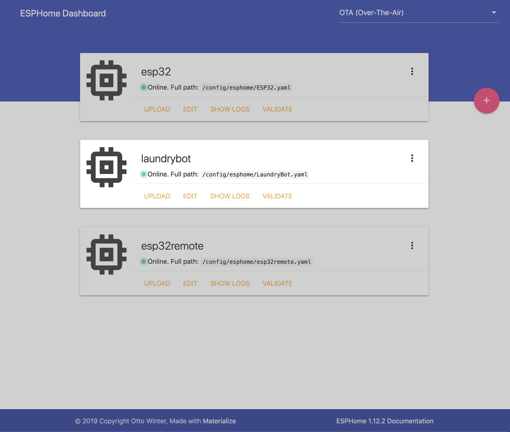

# LaundryBot
These days there is no shortage of _smart_ appliances. But does that mean we should neglect our _dumb_ pre-IoT machines just because they can't send a push notification?

I invite you to explore one way to get alerts about the state of any appliance regardless of its _smartness_ based on signal from a binary sensor. In this example I'm attaching an SW-420 vibration sensor to the back of a washer and dryer in a shared house to allow remote notification based on laundry room activity. 

While this guide centers around washer and dryer units, this concept may be extended to other appliances. For instance, you could use a thermocouple to send an alert when the oven is ready, etc.

To follow this guide you will need [Home Assistant](https://www.home-assistant.io/) running on the same network as the sensor unit.

> ## [Home Assistant](https://www.home-assistant.io/)
> Open source home automation that puts local control and privacy first.

There are other ways (IFTTT, Slack, Twitter) to get alerts from a sensor to your phone but that's a topic for another guide.

## Disclaimer
This guide assumes that the reader has intermediate knowledge and experience with electronics prototyping, soldering, scripting, and debugging. 
As with any project there are many ways to acheive the desired result and this is just one of them. 
While I hope this is helpful, I offer no warranty and assume no liability for the result of following any or all of the instructions in this guide.

## Here's what you'll need
- Home Assistant running on the local network
- ESP32
- SW-420 Normally Closed Vibration Sensor Module
- 22AWG stranded wire
- soldering kit or connector kit
- mini breadboard
- plastic enclosure
- USB cable

## Step 1: Set up the software
1. Install [Home Assistant](https://www.home-assistant.io/getting-started/)
2. Install [ESPHome](https://www.home-assistant.io/components/esphome/)
3. Compile and upload [LaundryBot.yaml](./LaundryBot.yaml) script to ESP32 using [ESPHome](https://esphome.io/guides/getting_started_hassio.html)

## Step 2: Set up the hardware
1. Connect SW-420 to breadboard

2. Cut out [perfboard](https://learn.adafruit.com/collins-lab-breadboards-and-perfboards/learn-more) and terminate sensor wires

3. Connect ESP32 to SW-420 sensor

4. Install sensor enclosures and plug in ESP32

5. Configure the sensor in Home Assistant

> Copyright 2019 Ryan Moore

   Licensed under the Apache License, Version 2.0 (the "License");
   you may not use this file except in compliance with the License.
   You may obtain a copy of the License at

       http://www.apache.org/licenses/LICENSE-2.0

   Unless required by applicable law or agreed to in writing, software
   distributed under the License is distributed on an "AS IS" BASIS,
   WITHOUT WARRANTIES OR CONDITIONS OF ANY KIND, either express or implied.
   See the License for the specific language governing permissions and
   limitations under the License.
